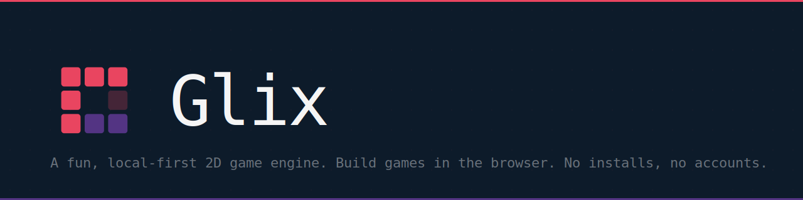

<div align="center">

[](/)
[](./LICENSE)
[](/)
[](/)
[](/)

**A fun, local-first 2D game engine for the browser.**  
Build games visually. Save as a single `.glix` file. No installs, no accounts, no backend.

[Try Glix](https://glix.vercel.app) · [Report a bug](../../issues) · [Request a feature](../../issues)

</div>

---

## What is Glix?

Glix is a browser-based 2D game engine with a built-in visual editor. You open it in any browser, build your game, and save everything to a single `.glix` file on your own machine. Share projects by sharing the file. Export finished games as standalone HTML.

It sits between **Godot** (powerful but desktop-only) and **PlayCanvas** (browser-based but account-required). Glix is designed for indie developers who want fast iteration in a tool that gets out of the way.

## Features

- **Visual editor** — viewport, hierarchy, inspector, script editor, all in the browser
- **Entity-Component System** — clean architecture, fully scriptable with TypeScript
- **WebGL2 renderer** — batched sprite rendering, custom shaders, post-processing
- **2D physics** — rigid bodies and collision via Planck.js
- **Tilemap editor** — paint tiles, auto-collision, multiple layers
- **Local-first storage** — everything lives in your `.glix` file, auto-saved to IndexedDB
- **One-click export** — self-contained HTML bundle, runs anywhere
- **No accounts required** — open the URL and start building

## Getting Started

```bash
git clone https://github.com/your-username/glix
cd glix
pnpm install
pnpm dev
```

Or open [glix.vercel.app](https://glix.vercel.app) directly — no install needed.

## Project File Format

Every Glix project is a `.glix` file — a single JSON document containing your scenes, entities, components, and all assets base64-encoded inline.

```json
{
  "version": "1.0",
  "engine": "glix",
  "meta": {
    "name": "My Game",
    "resolution": { "width": 1280, "height": 720 }
  },
  "assets": {
    "tex_player": {
      "type": "texture",
      "data": "data:image/png;base64,..."
    }
  },
  "scenes": {
    "scene_main": { "entities": [] }
  },
  "settings": { "startScene": "scene_main" }
}
```

`Ctrl+S` — save to `.glix` file  
`Ctrl+O` — open a `.glix` file  
`File → Export HTML` — export standalone game

## Tech Stack

| Layer | Choice |
|---|---|
| Engine runtime | TypeScript + WebGL2 + gl-matrix |
| Physics | Planck.js |
| Editor UI | React + Vite + Zustand |
| Scripting | Monaco Editor + esbuild-wasm |
| Persistence | IndexedDB + File System Access API |
| Hosting | Vercel (static, no server) |
| Monorepo | pnpm workspaces |

## Repo Structure

```
glix/
├── packages/
│   ├── runtime/     # Engine core — ECS, WebGL2, physics, audio
│   ├── editor/      # React SPA — editor UI, panels, file I/O
│   └── shared/      # Types, .glix schema, utilities
├── vercel.json
├── pnpm-workspace.yaml
└── package.json
```

## Status

Glix is under active development. This README describes the intended final state of the project. Features listed here represent the design goal — not all are available yet.

## License

MIT

---

<div align="center">
  <sub>Built with monospace fonts and too much coffee.</sub>
</div>
